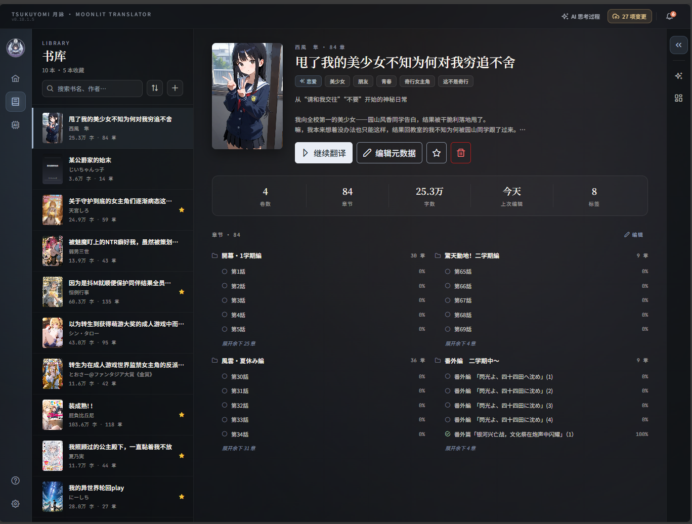
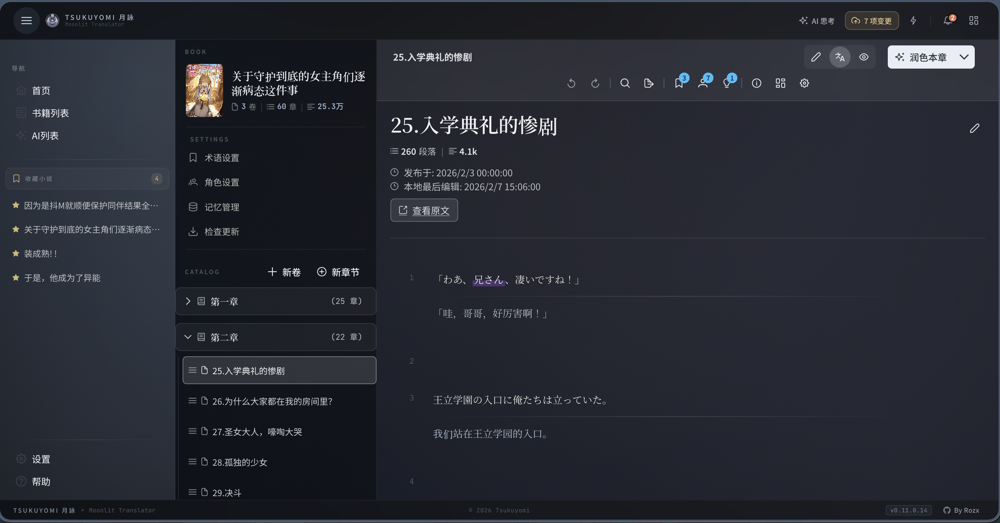
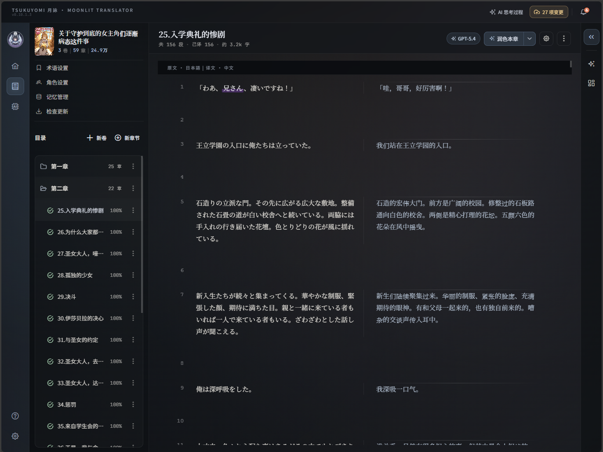
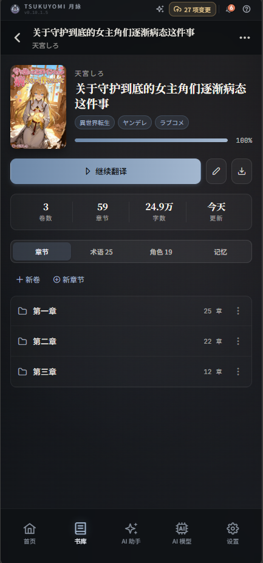
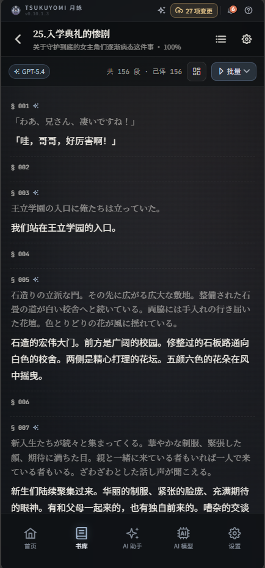
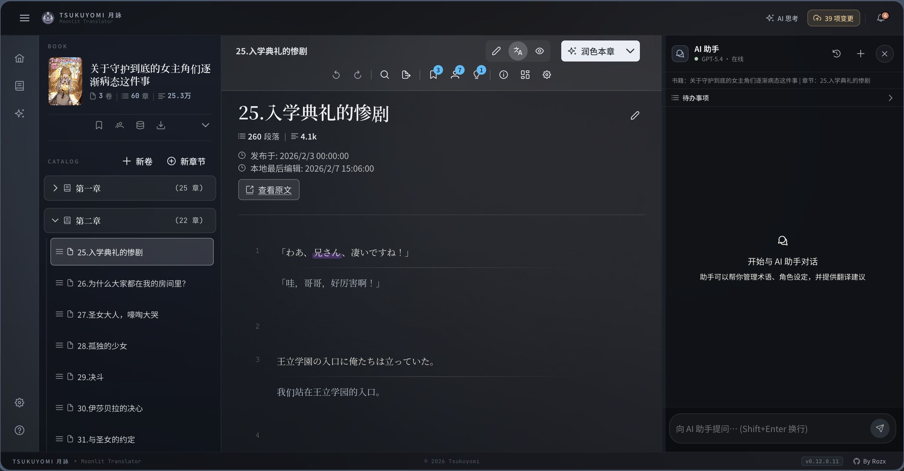
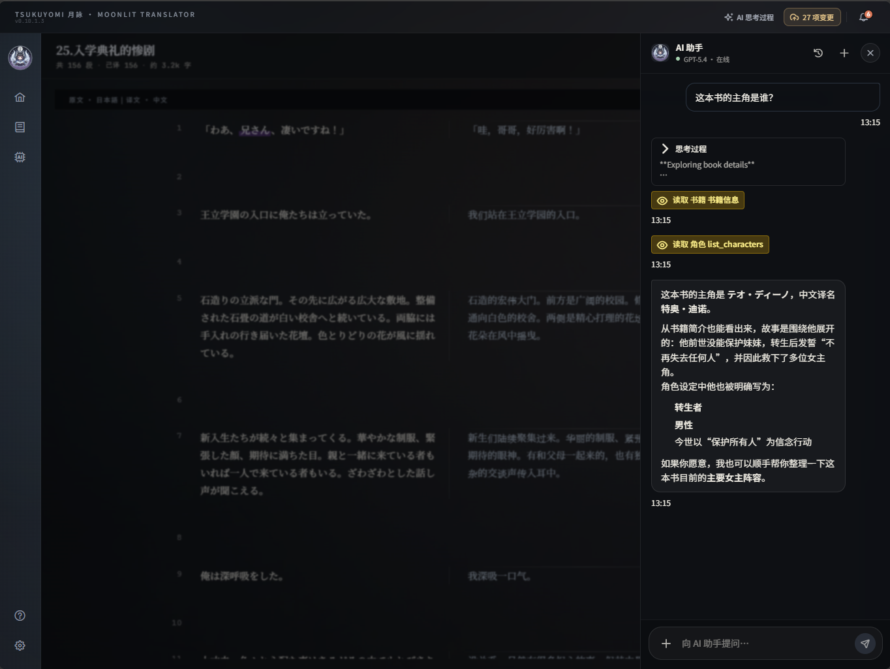
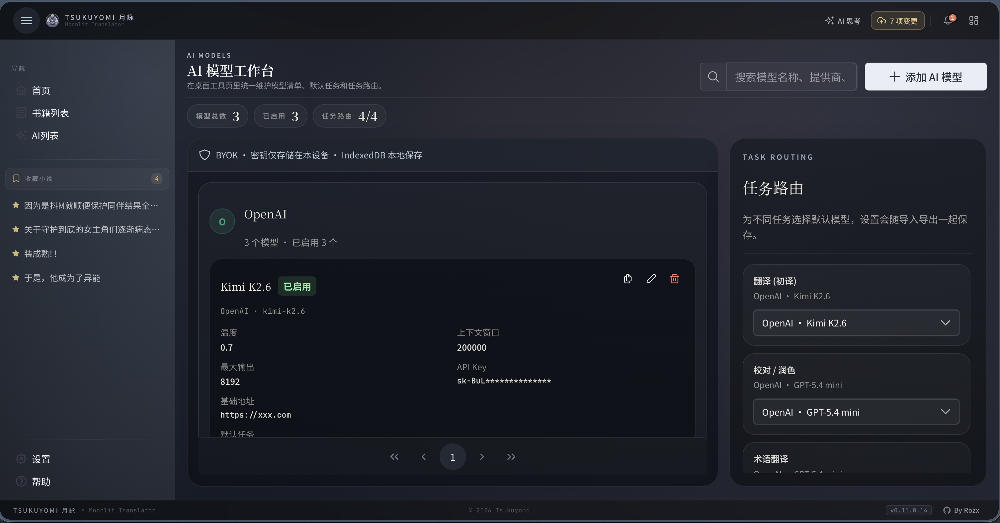
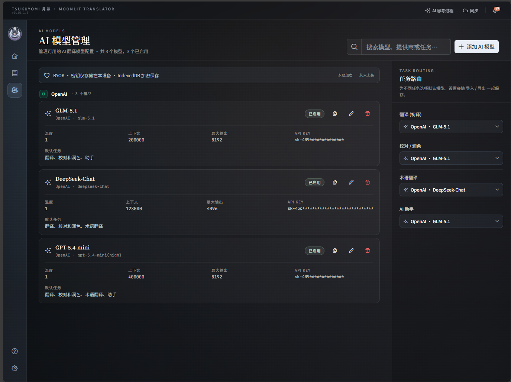
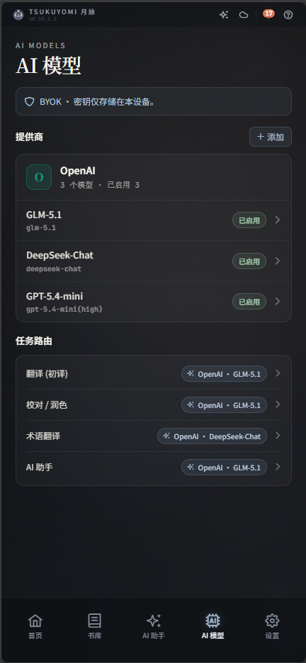

# Tsukuyomi (月詠) - Moonlit Translator

      

[](https://github.com/rozx/Tsukuyomi/releases)

    


> 面向日本轻小说的 AI 导入、阅读与翻译工具。

**Tsukuyomi (月詠)** 将小说导入、双语阅读、翻译、润色和校对放在同一个工作台中。使用自己的 API Key 接入 OpenAI、Gemini 或兼容 OpenAI 协议的服务，通过术语、角色设定和记忆库为翻译提供上下文。支持网页版与 Electron 桌面版。

- [打开网页版](https://tsukuyomi.rozx.moe/)
- [下载桌面版](https://github.com/rozx/Tsukuyomi/releases/latest)

## 📥 v0.16 新增：AI 导入工作台

给月詠一个小说网址，或拖入 TXT、Markdown、HTML、EPUB 文件，再说明要导入哪些内容。她会检查来源、提取正文并整理卷章，你可以直接修改草稿，检查方案后再确认导入书库。

例如，添加 EPUB 后可以这样说：

> 请把这个 EPUB 导入为一本新小说，按目录分卷分章，保留序言和后记，并列出缺失章节。

- **批量整理**：支持整本 TXT 按标题拆章、Markdown 按标题层级分卷，以及批量清理正文杂质、替换卷章标题。
- **检查后导入**：预览正文、选择章节、编辑书籍资料与标签；可新建小说，也可给已有小说补章。方案会列出变化和将清空的译文数量。
- **暂停与补齐**：任务保存在当前设备，可以暂停后继续、重试失败章节，或先导入已成功的部分。书籍没有后续修改时可整次撤销。
- **连载后续更新**：符合条件的网站可保存「更新配方」，记录目录、正文提取和清理规则，以后直接在书籍详情中检查新章与原文修订。

流程：**添加来源 → 与月詠对话 → 检查卷章草稿 → 确认导入**。开始前需配置「助手」默认模型；需要登录或人机验证的网站可能需要改为提供文件。

[查看分步操作与示例指令](public/help/import-guide.md) · [阅读 v0.16.0 发布说明](public/releaseNotes/RELEASE_NOTES_v0.16.0.md)


## ✨ 核心功能详情

### 🤖 AI 模型配置

Tsukuyomi 采用 Bring Your Own Key 模式，内置两种提供商：

- **OpenAI**：填写 API Key、基础地址与模型 ID，也可用于兼容 OpenAI 协议的服务或网关。
- **Gemini**：使用 Google Generative AI SDK 接入，填写 API Key 与模型 ID。

其他模型需要通过受支持的兼容接口接入，具体可用模型与工具调用能力取决于服务端。可在界面拉取模型列表、验证连接，并配置自定义请求头及浏览器 CORS 代理。

翻译、校对/润色、术语翻译和助手可分别设置默认模型；单本书还可覆盖翻译与校对/润色模型。详见 [AI 模型配置](public/help/ai-models-guide.md)。

### 📚 智能翻译与阅读

在书籍详情页阅读、编辑和处理章节：

- **双语对照**: 按段落查看原文与译文，支持翻译、原文编辑和译文预览三种模式。
- **全流程 AI 操作**:
  - **初翻 (Translate)**: 结合术语、角色设定和检索到的上下文生成译文。
  - **润色 (Polish)**: 消除"翻译腔"，让译文更符合中文地道表达。
  - **校对 (Proofreading)**: 自动检查漏译、错别字及格式问题。
- **多版本并存**: 对同一段落可尝试不同模型，一键切换各版本择优使用。
- **任务进度**: 查看翻译进度、待办事项、思考与输出时间线，以及工具调用详情。

### 🧩 深度上下文管理系统 (Context Engine)

通过术语、角色设定、记忆和章节检索，为 AI 提供当前段落之外的参考信息：

#### 1. 📖 术语表 (Glossary)

- **译法参考**: 为地名、技能名和特定名词记录统一译法，供翻译任务使用。
- **语义引导**: 为术语添加描述，让 AI 理解其在故事中的具体作用。

#### 2. 👥 角色设定 (Character Settings)

- **多维属性**: 定义角色的 **性别**、**语气**、**口癖**、**性格特征**。
- **别名识别**: 建立别名库，让 AI 明白"勇者"、"那个家伙"、"佐藤"指向的是同一个人。
- **语气参考**: 将角色口吻和性格描述传给 AI，辅助保持对话风格一致。

#### 3. 🧠 记忆库 (Memory Bank)

- **世界观沉淀**: 记录复杂的势力关系、魔法系统规则、关键剧情伏笔。
- **语义优先的记忆检索**: Embedding 可用时按语义相似度、关键词匹配和时间衰减自动评分（权重 0.85 / 0.10 / 0.05）；关闭或不可用时回退到关键词和时间衰减（0.75 / 0.25）。总分归一到 0–1.0，并按字符预算注入最相关记忆。
- **本地语义嵌入（可选）**: 内置 `gte-multilingual-base` 多语言编码器（Transformers.js），通过 WebGPU + q4f16 运行，不支持时自动回退 WASM + int8。嵌入计算在本地完成，不消耗 AI API 额度；默认关闭，需在「设置 → 本地嵌入」中启用，物理移动设备上禁用。
- **混合搜索**: `search_memories` 工具支持自然语言查询，同时利用关键词匹配和语义向量排序；关闭嵌入时自动退化为关键词 + 时间衰减。

#### 4. 📑 章节语义索引 (Chapter Vector Index)

- **多向量章节索引**: 启用本地嵌入后，为每个章节按约 100 字的段落边界建立原生 768 维多向量索引，并额外为"章节标题 + 首段"写入专属向量，支持标题 / 系列 / 主题型查询。
- **`query_chapter` 混合检索**: AI 可用自然语言跨章节搜索原文；先在章节粒度校准语义置信度并融合语义 / 关键词 RRF 排名，再按 `0.85 × 语义 + 0.15 × 关键词` 排序并过滤弱匹配。翻译、润色、校对、聊天助手四类任务的提示词已学会调用该工具获取前文上下文。
- **批量管理**: 在书籍详情的「向量索引」面板查看索引记录、重建和批量重算，也可测试查询结果。详见 [本地嵌入](public/help/local-embedding.md)。

### 💬 AI 协作聊天助手

月詠可结合当前书籍上下文回答问题，并通过工具协助操作：

- **实时协助**: 随时询问 "这句话的梗在哪？" 或 "这里怎么翻译才能保留原作者的俏皮感？"。
- **自动化操控**: 直接通过对话修改书籍信息或增删术语，例如："帮我把这本书改成完结状态"。
- **内置知识库**: 遇到软件使用问题，AI 会检索官方帮助文档为您解答。

### ☁️ 跨设备同步

- **Gist 云同步**: 可选择将数据同步到自己的 GitHub Gist，支持查看修订历史和恢复可用快照。
- **Manifest 增量同步**: 基于 `manifest.json` 与 SHA-256 哈希选择变化条目，使用条件请求减少下载；上传前复核 ETag，检测并发变化后重新合并重试。
- **跨端删除一致**: Manifest 使用墓碑（tombstones）传递删除语义，A 设备删除的条目不会被 B 设备重新推回。
- **段落合并**: 有同步结构基准时，保留单端的原文修订与删除；只有原文一致的段落才合并译文，两端都改过结构时提示检查冲突。
- **强制推送模式**: 将远端数据替换为本地快照，覆盖前可核对来源设备与目标 Gist。

### 📱 全设备适配

- **桌面 / 平板 / 移动**: Dispatcher + 三变体架构，桌面保持信息密度、平板提供双面板阅读与可停靠 AI 助手、移动端采用底部 Tab 栏 + BottomSheet 的原生化体验。
- **Electron 桌面版**: 一套代码同时打包 Web SPA 与跨平台桌面客户端，桌面端强制使用 Desktop 变体。

## 📸 界面预览

以下截图展示桌面、平板和手机上的首页、书库、阅读器与模型管理页面。

### 🏠 首页 · Dashboard


|                                 平板 · Tablet                                 |                                 手机 · Mobile                                 |
| :---------------------------------------------------------------------------: | :---------------------------------------------------------------------------: |
|  |  |

### 📚 书库 · Library


|                                  平板 · Tablet                                  |                                  手机 · Mobile                                  |
| :-----------------------------------------------------------------------------: | :-----------------------------------------------------------------------------: |
|  |  |

### 📖 书籍详情 / 阅读器 · Book Details & Reader

> 桌面与平板采用双面板布局，将章节树、元数据、段落阅读合并为同一视图；手机端则拆分为独立页面以适配竖屏空间。



|                                      平板 · Tablet                                       |                                     手机 (书籍详情)                                      |                                  手机 (阅读器)                                   |
| :--------------------------------------------------------------------------------------: | :--------------------------------------------------------------------------------------: | :------------------------------------------------------------------------------: |
|  |  |  |

### 💬 AI 助手协作 · Reader + Chat Workspace

右侧面板可停靠，随时召唤 AI 助手；启用本地嵌入后可使用 `query_chapter` / `search_memories` 工具跨章节、跨记忆检索上下文。



|                                            平板 · Tablet                                             |                                        手机 · Mobile                                         |
| :--------------------------------------------------------------------------------------------------: | :------------------------------------------------------------------------------------------: |
|  |  |

### 🤖 AI 模型管理 · Model Management



|                                     平板 · Tablet                                     |                                     手机 · Mobile                                     |
| :-----------------------------------------------------------------------------------: | :-----------------------------------------------------------------------------------: |
|  |  |

## 🔒 隐私与数据主权

本地存储、AI 请求和云同步分别处理数据：

- **本地存储**: 书籍、译文、术语、记忆、配置与导入任务默认保存在当前浏览器或 Electron 数据目录的 IndexedDB 中。已保存内容可本地阅读和编辑；调用远端 AI、网页抓取、联网搜索及 Gist 同步需要网络。
- **AI 请求**: 翻译、聊天和 AI 导入会把所需文本与上下文发送给配置的模型服务。浏览器端默认启用 CORS 代理，可按模型关闭；Electron 的 AI 请求直连配置的服务地址。
- **密钥与同步范围**: 模型 API Key 随模型配置本地保存，开启 Gist 同步后也会随 AI 模型配置同步。GitHub 同步 Token 保留在当前设备，不写入同步包。应用未额外加密这些本地凭据。
- **本地语义嵌入**: 启用"本地嵌入"后，记忆库与章节语义索引使用 Transformers.js 在浏览器 / Electron 内部运行，**不上传任何文本到外部嵌入服务**；模型文件下载后自动缓存到浏览器 Cache Storage。
- **可选 Gist 云同步**: 同步书籍、记忆、模型、封面及应用设置；AI 导入任务与中间草稿仅保存在当前设备，确认导入后的书籍可正常同步。

## 🚀 快速开始

### 1. 打开应用，配置模型

使用 [网页版](https://tsukuyomi.rozx.moe/) 或 [下载桌面版](https://github.com/rozx/Tsukuyomi/releases/latest)，无需先克隆源码。打开「AI 列表」，添加模型并设置翻译、校对/润色和助手的默认模型。AI 导入工作台使用「助手」默认模型。

### 2. 导入一本小说

1. 打开「AI 导入」，点击「新任务」。
2. 在「来源」中添加小说网址，或选择／拖入 TXT、Markdown、HTML、EPUB 文件。
3. 在对话中说明导入范围、分卷分章要求，让月詠整理。
4. 在「卷章草稿」检查书籍资料、章节顺序和正文。
5. 生成「导入方案」，核对目标书籍、缺失章节和译文影响，再点击「确认导入」。完成后点「打开小说」。

更多例子见 [AI 导入工作台指南](public/help/import-guide.md)。也可以在书库中选择「从网站导入」，使用内置规则处理 `ncode.syosetu.com`、`novel18.syosetu.com`、`kakuyomu.jp`、`syosetu.org`；其他站点可转交 AI 导入器。应用格式的 JSON 书籍文件可通过「从 JSON 导入」添加，完整资料备份在设置中恢复。

### 3. 从源码运行

本项目基于 [Bun](https://bun.sh) 构建：

```bash
# 克隆仓库并进入
git clone https://github.com/rozx/Tsukuyomi.git
cd Tsukuyomi

# 安装依赖
bun install

# 首次 clone 后注册提交钩子（提交时自动递增构建号）
bun run setup:git-hooks

# 开启开发环境
bun run dev
```

`bun run dev` 启动 Quasar/Vite 开发服务器，默认位于 `http://localhost:9000`，可用 `PORT` 环境变量修改端口。Electron 开发使用 `bun run dev:electron`。

## 📖 文档索引

| 文档类别     | 详细指南 (位于 `public/help`)                                                                                                                                |
| :----------- | :----------------------------------------------------------------------------------------------------------------------------------------------------------- |
| **基础配置** | [快速开始](public/help/front-page.md) \| [AI 模型配置](public/help/ai-models-guide.md) \| [设置与同步](public/help/settings-guide.md)                        |
| **书籍管理** | [图书馆介绍](public/help/library-guide.md) \| [导入与抓取](public/help/books-page-guide.md) \| [章节管理](public/help/book-details-chapters.md)              |
| **翻译实战** | [翻译功能面板](public/help/book-details-translation.md) \| [三种编辑模式](public/help/book-details-editing.md) \| [工具栏详解](public/help/toolbar-guide.md) |
| **核心逻辑** | [术语管理](public/help/book-details-terminology.md) \| [角色设定](public/help/book-details-characters.md) \| [记忆系统](public/help/book-details-memory.md)  |
| **AI 导入**  | [导入工作台：分步操作、拆章与补章](public/help/import-guide.md) \| [v0.16.0 发布说明](public/releaseNotes/RELEASE_NOTES_v0.16.0.md)                          |
| **进阶工具** | [聊天助手实战](public/help/chat-assistant-guide.md) \| [本地嵌入与章节检索](public/help/local-embedding.md)                                                  |

> 应用内「帮助」可查阅使用指南；主分支文档通过工作流同步到 [GitHub Wiki](https://github.com/rozx/Tsukuyomi/wiki)。

## 🧱 技术栈

| 层级              | 技术                                                                                                                  |
| :---------------- | :-------------------------------------------------------------------------------------------------------------------- |
| **前端框架**      | Vue 3.5 · Quasar 2.20 · TypeScript 5.9 · Pinia 3 · PrimeVue 4.5 · Tailwind CSS 3.4 · Vue-i18n (zh-CN / zh-TW / en-US) |
| **桌面封装**      | Electron 39（Web SPA 与桌面端共用同一份代码，通过 `useDeviceVariant` 强制 Desktop 变体）                              |
| **运行时 / 构建** | Bun ≥ 1.0 · Vite · Quasar CLI                                                                                         |
| **AI SDK**        | OpenAI SDK · Google Generative AI；通过 OpenAI 配置接入兼容协议服务（BYOK）                                           |
| **本地嵌入**      | Transformers.js (ONNX Runtime Web) · `gte-multilingual-base` · 768 维 · WebGPU + q4f16（优先）/ WASM + int8（回退）   |
| **存储 / 同步**   | IndexedDB (`idb`) · GitHub Gist (`@octokit/rest`) · SHA-256 哈希 manifest · 条件 GET + 伪 CAS 并发保护                |
| **抓取**          | Puppeteer + `puppeteer-extra-plugin-stealth`（Electron 桌面版）/ HTTP 代理轮询（Web 版）                              |
| **AI 导入**       | 工具调用整理草稿 · Web Worker 文件解析 · EPUB/ZIP（fflate）· Web Locks 跨标签页互斥                                   |
| **测试 / 质量**   | Vitest（jsdom）· fake-indexeddb · Istanbul 覆盖率 · ESLint · vue-tsc · Fallow                                         |

## 🛠️ 开发与构建

| 命令                      | 用途                                                                               |
| :------------------------ | :--------------------------------------------------------------------------------- |
| `bun install`             | 安装依赖                                                                           |
| `bun run setup:git-hooks` | 首次 clone 后注册 pre-commit 构建号钩子                                            |
| `bun run dev`             | 启动 Web 开发服务器（默认 9000）                                                   |
| `bun run dev:electron`    | 启动 Electron 开发模式                                                             |
| `bun run build:spa`       | 构建生产环境 Web SPA                                                               |
| `bun run build:electron`  | 按目标平台打包桌面客户端（macOS: dmg/zip；Windows: portable exe；Linux: AppImage） |
| `bun run lint`            | 代码规范性检测                                                                     |
| `bun run type-check`      | TypeScript 类型检查                                                                |
| `bun run quality-check`   | Fallow 分析及差异范围 CI 门禁                                                      |
| `bun run format`          | Prettier 格式化                                                                    |
| `bun run test`            | 使用 Vitest 运行测试套件                                                           |
| `bun run test:watch`      | Vitest 监听模式                                                                    |
| `bun run test:coverage`   | 运行测试并生成 Istanbul 覆盖率                                                     |
| `bun bump <version>`      | 更新发布版本，例如 `bun bump 0.16.0`                                               |

**开发者文档**: [构建故障排查](docs/BUILD_TROUBLESHOOTING.md) \| [主题指南](docs/THEME_GUIDE.md) \| [翻译指南](docs/TRANSLATION_GUIDE.md) \| [Wiki 同步](docs/WIKI_SYNC.md) \| [贡献者指南](AGENTS.md) \| [项目约定 (Claude Code)](CLAUDE.md)

## 🤝 贡献

欢迎 Issue、PR、以及翻译器使用反馈。提交代码前请：

1. 运行 `bun run lint && bun run type-check && bun run quality-check`；
2. 新功能、修 bug 和运行时逻辑变更遵循 TDD：先写失败测试，再实现并确认通过。测试位于 `src/__tests__/`，使用 `bun run test`；纯文档、样式和配置改动可不新增测试；
3. UI 改动需在桌面 / 平板 / 手机三个断点验证，遵循 [AGENTS.md](AGENTS.md) 的设备变体规则。

## 📄 许可证

[Apache License 2.0](LICENSE) — 可自由用于个人与商业用途，请在二次分发时保留版权声明。

---

> _Tsukuyomi - 让每一次翻页都如月光般流畅。_
