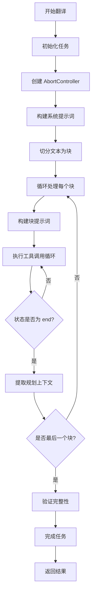
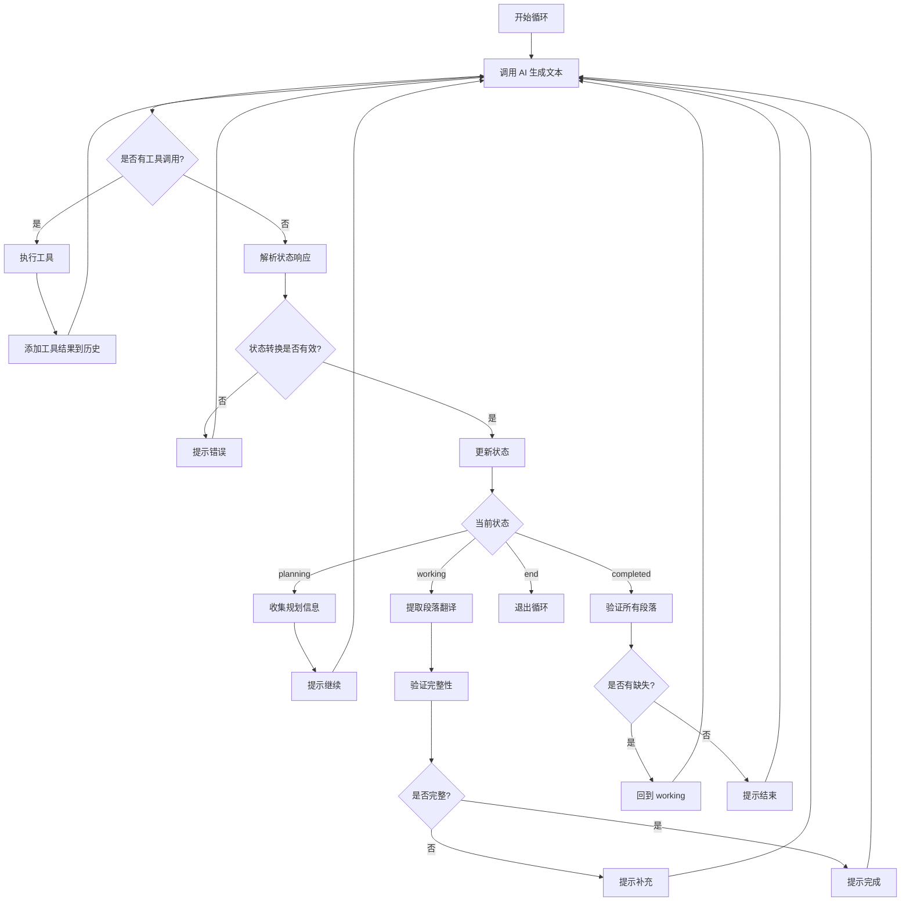

# 翻译相关 AI 任务流程文档

本文档详细描述了 Luna AI Translator 中翻译相关 AI 任务的完整流程、提示词结构和执行机制。

## 目录

1. [概述](#概述)
2. [任务类型](#任务类型)
3. [核心流程](#核心流程)
4. [状态机机制](#状态机机制)
5. [提示词结构](#提示词结构)
6. [工具调用机制](#工具调用机制)
7. [分块处理机制](#分块处理机制)
8. [错误处理与重试](#错误处理与重试)
9. [服务实现](#服务实现)

---

## 概述

Luna AI Translator 使用基于状态机的 AI 任务执行流程，通过工具调用循环实现智能翻译、润色和校对功能。系统采用分块处理策略，支持长文本的高效处理，并通过规划上下文共享机制优化多块处理的效率。

### 核心特性

- **状态驱动**：使用 `planning → working → completed → end` 状态机控制任务流程
- **工具增强**：AI 可以通过工具调用获取上下文信息、管理术语/角色、创建记忆等
- **分块处理**：将长文本分割为多个块（chunks），每个块独立处理
- **上下文共享**：第一个块的规划上下文会传递给后续块，避免重复获取
- **实时更新**：段落翻译和标题翻译通过回调实时更新 UI

---

## 任务类型

系统支持三种主要的翻译相关任务类型：

### 1. Translation（翻译）

**服务类**：`TranslationService`

**功能**：将日语小说文本翻译为简体中文

**特点**：
- 支持章节标题翻译
- 1:1 段落对应（禁止合并/拆分）
- 自动术语和角色管理
- 敬语处理流程

**配置**：
- 块大小：2500 字符
- 温度：`model.isDefault.translation?.temperature ?? 0.7`

### 2. Term Translation（术语翻译）

**服务类**：`TermTranslationService`

**功能**：翻译单个术语或短语

**特点**：
- 快速路径：短文本（≤50字符）或无 bookId 时直接翻译
- 标准路径：使用工具获取上下文信息
- 只返回 JSON 格式

**配置**：
- 温度：`model.isDefault.termsTranslation?.temperature ?? 0.7`
- 最大工具调用次数：10
- JSON 重试次数：3

### 3. Polish（润色）

**服务类**：`PolishService`

**功能**：优化已翻译文本的表达

**特点**：
- 语气词优化
- 摆脱翻译腔
- 节奏调整
- 角色语言区分

### 4. Proofreading（校对）

**服务类**：`ProofreadingService`

**功能**：检查翻译文本的错误

**特点**：
- 文字检查（错别字/标点/语法）
- 内容检查（一致性/逻辑）
- 格式检查

---

## 核心流程

### 翻译服务主流程



### 工具调用循环流程



---

## 状态机机制

### 状态定义

系统使用四种状态控制任务流程：

1. **planning（规划阶段）**
   - 获取上下文信息（术语表、角色表、记忆等）
   - 检查数据问题并修复
   - 准备开始翻译工作

2. **working（工作阶段）**
   - 执行实际翻译/润色/校对工作
   - 输出结果（段落翻译）
   - 发现新信息立即更新（术语/角色）

3. **completed（验证阶段）**
   - 系统自动验证完整性
   - 更新术语/角色描述
   - 创建记忆保存重要信息

4. **end（完成）**
   - 当前块已完成
   - 系统将自动提供下一个块

### 状态转换规则

**允许的转换**：
- `planning → working`：规划完成，开始工作
- `working → completed`：工作完成，进入验证
- `completed → end`：验证完成，结束当前块
- `completed → working`：需要补充缺失段落或编辑已翻译段落

**禁止的转换**：
- `working → end`：必须经过 `completed`
- `planning → completed`：必须经过 `working`
- `planning → end`：必须经过 `working` 和 `completed`

### 状态循环检测

系统会检测状态循环，防止 AI 在同一状态停留过久：

- **最大连续次数**：同一状态最多连续出现 2 次
- **检测机制**：记录每个状态的连续出现次数
- **处理方式**：超过阈值时强制要求状态转换

---

## 提示词结构

### 系统提示词（System Prompt）

系统提示词包含以下部分：

#### 1. 基础角色定义

```
你是专业的日轻小说翻译助手，将日语翻译为自然流畅的简体中文。
```

#### 2. 待办事项提示（可选）

如果提供了 `taskId`，会包含待办事项系统提示：

```typescript
const todosPrompt = taskId ? getTodosSystemPrompt(taskId) : '';
```

#### 3. 章节上下文信息

```typescript
buildChapterContextSection(chapterId, chapterTitle)
```

格式：
```
【当前章节信息】
**当前章节 ID**: `章节ID`
**当前章节标题**: 章节标题
```

#### 4. 特殊指令（用户自定义）

```typescript
buildSpecialInstructionsSection(specialInstructions)
```

格式：
```
========================================
【特殊指令（用户自定义）】
========================================
用户自定义的特殊指令内容
```

#### 5. 核心规则

```
【核心规则】
1. **1:1对应**: 一个原文段落=一个翻译段落，禁止合并/拆分
2. **术语一致**: 使用术语表和角色表确保全文一致
3. **自然流畅**: 符合轻小说风格，适当添加语气词（按角色speaking_style）
4. **前后一致**: 参考前文翻译，保持人名/术语/风格一致
5. **格式规则**: 使用全角中文标点（，。？！：；""（）——……），保持原文换行/缩进，数字英文保持半角
```

#### 6. 数据管理规则

```typescript
getDataManagementRules()
```

包含：
- 敬语处理流程
- 术语/角色分离规则
- 数据更新规则
- 禁止事项（如禁止将敬语添加为别名）

#### 7. 工具使用说明

```typescript
getToolUsageInstructions('translation')
```

包含常用工具列表和使用建议。

#### 8. 记忆管理规则

```typescript
getMemoryWorkflowRules()
```

包含记忆的创建、搜索和更新流程。

#### 9. 输出格式要求

```typescript
getOutputFormatRules('translation')
```

包含：
- JSON 格式要求
- 状态字段说明
- 段落 ID 对应规则

#### 10. 执行工作流说明

```typescript
getExecutionWorkflowRules('translation')
```

包含各阶段的工作重点。

### 用户提示词（User Prompt）

#### 第一个块（Chunk 0）

```typescript
buildIndependentChunkPrompt(
  'translation',
  0,
  totalChunks,
  chunkText,
  paragraphCountNote,
  maintenanceReminder,
  chapterId,
  chapterTitle, // 只在第一个块包含
  undefined, // 无规划上下文
)
```

格式：
```
开始翻译任务。**请先将状态设置为 "planning" 开始规划**（返回 `{"status": "planning"}`）。

**章节标题翻译**：请翻译以下章节标题，并在输出 JSON 中包含 `titleTranslation` 字段：
【章节标题】章节标题

以下是第一部分内容（第 1/总数 部分）：[段落数量提示]

[块文本内容]

[维护提醒]

[上下文获取警告]
```

#### 后续块（Chunk > 0）

如果有规划上下文：
```
继续翻译任务（第 X/总数 部分）。

【从前一部分继承的规划上下文】
[规划摘要]

**[警告] 重要：简短规划阶段**
以上是前一部分已获取的规划上下文（包括术语、角色、记忆等信息），**请直接使用这些信息，不要重复调用工具获取**。

**禁止重复调用的工具**：`list_terms`、`list_characters`、`get_chapter_info`、`get_book_info`、`list_chapters` 等已在上下文中提供的工具。

**允许调用的工具**：`get_previous_paragraphs`、`get_next_paragraphs`、`find_paragraph_by_keywords` 等用于获取当前段落前后文上下文的工具。

**现在请直接确认收到上下文**（返回 `{"status": "planning"}`），然后立即将状态设置为 "working" 并开始翻译。

以下是待翻译内容：[段落数量提示]

[块文本内容]

[维护提醒]
```

如果没有规划上下文：
```
继续翻译任务。以下是第 X/总数 部分内容：[段落数量提示]

[块文本内容]

[维护提醒]

[上下文获取警告]
```

### 状态信息提示

系统会根据当前状态向 AI 提供状态信息：

```typescript
getCurrentStatusInfo(taskType, status, isBriefPlanning?)
```

#### Planning 状态

```
**当前状态：规划阶段 (planning)**
你当前处于规划阶段，应该：
- 获取术语表和角色表（使用 `list_terms` 和 `list_characters`，传入 chapter_id）
- 检查数据问题（如空翻译、重复项、误分类等），发现问题立即修复
- 搜索相关记忆（使用 `search_memory_by_keywords`）了解上下文
- 准备开始翻译工作

完成规划后，将状态设置为 "working" 并开始翻译。
```

#### Working 状态

```
**当前状态：翻译中 (working)**
你当前处于翻译阶段，应该：
- 专注于翻译工作：1:1翻译，敬语按流程处理
- 发现新信息（新术语/角色、关系变化等）立即更新
- 输出翻译结果，格式：`{"status": "working", "paragraphs": [{"id": "段落ID", "translation": "翻译结果"}]}`

完成所有段落的翻译后，将状态设置为 "completed"。
```

#### Completed 状态

```
**当前状态：验证阶段 (completed)**
你当前处于验证阶段，应该：
- 系统已自动验证完整性
- 更新术语/角色描述（如有新发现）
- 创建记忆保存重要信息（如敬语翻译方式、角色关系等）
- 检查是否有遗漏或需要修正的地方

如果需要补充缺失段落或编辑/优化已翻译的段落，可以将状态设置为 "working" 继续工作。
如果所有工作已完成，将状态设置为 "end"。
```

#### End 状态

```
**当前状态：完成 (end)**
当前块已完成，系统将自动提供下一个块。
```

---

## 工具调用机制

### 工具注册表

系统使用 `ToolRegistry` 管理所有可用工具：

```typescript
// 获取翻译任务工具（排除翻译管理工具）
const tools = ToolRegistry.getToolsExcludingTranslationManagement(bookId);

// 获取术语翻译工具（限制工具集）
const tools = ToolRegistry.getTermTranslationTools(bookId);
```

### 工具调用流程

1. **AI 生成工具调用请求**
   - AI 在响应中包含 `tool_calls` 字段
   - 每个工具调用包含 `id`、`function.name`、`function.arguments`

2. **执行工具调用**
   ```typescript
   const toolResult = await ToolRegistry.handleToolCall(
     toolCall,
     bookId,
     handleAction,
     onToast,
     taskId,
   );
   ```

3. **添加工具结果到历史**
   ```typescript
   history.push({
     role: 'tool',
     content: toolResult.content,
     tool_call_id: toolCall.id,
     name: toolCall.function.name,
   });
   ```

4. **继续循环**
   - AI 基于工具结果继续生成响应

### 常用工具

#### 术语管理
- `list_terms`: 获取术语表（支持 `chapter_id`）
- `get_term`: 根据名称获取术语
- `search_terms_by_keywords`: 搜索术语
- `create_term`: 创建术语
- `update_term`: 更新术语
- `delete_term`: 删除术语

#### 角色管理
- `list_characters`: 获取角色表（支持 `chapter_id`）
- `get_character`: 根据名称获取角色
- `search_characters_by_keywords`: 搜索角色
- `create_character`: 创建角色
- `update_character`: 更新角色
- `delete_character`: 删除角色

#### 记忆管理
- `search_memory_by_keywords`: 搜索记忆
- `get_memory`: 获取记忆
- `get_recent_memories`: 获取最近记忆
- `create_memory`: 创建记忆
- `update_memory`: 更新记忆

#### 上下文获取
- `get_book_info`: 获取书籍信息
- `get_chapter_info`: 获取章节信息
- `get_previous_paragraphs`: 获取前文段落
- `get_next_paragraphs`: 获取后文段落
- `find_paragraph_by_keywords`: 搜索段落

---

## 分块处理机制

### 块大小

```typescript
TranslationService.CHUNK_SIZE = 2500; // 字符数
```

### 块构建

```typescript
const chunks = buildChunks(
  content, // 段落列表
  TranslationService.CHUNK_SIZE,
  (p) => `[ID: ${p.id}] ${p.text}\n\n`, // 格式化函数
  (p) => !!p.text?.trim(), // 过滤函数（排除空段落）
);
```

### 块处理

1. **独立历史**：每个块使用独立的 `history`，避免上下文共享
2. **规划上下文共享**：第一个块的规划摘要传递给后续块
3. **实时回调**：段落翻译和标题翻译通过回调实时更新 UI

### 规划上下文提取

在 `planning → working` 状态转换时，系统会提取规划摘要：

```typescript
if (previousStatus === 'planning' && newStatus === 'working' && !planningSummary) {
  // 构建规划摘要
  const summaryParts: string[] = [];
  
  // AI 规划决策
  if (planningResponses.length > 0) {
    summaryParts.push('【AI规划决策】');
    summaryParts.push(planningResponses.join('\n'));
  }
  
  // 关键工具结果摘要
  if (planningToolResults.length > 0) {
    summaryParts.push('\n【已获取的上下文信息】');
    for (const { tool, result } of planningToolResults) {
      const truncatedResult = result.length > 500 
        ? result.slice(0, 500) + '...(已截断)' 
        : result;
      summaryParts.push(`- ${tool}: ${truncatedResult}`);
    }
  }
  
  planningSummary = summaryParts.join('\n');
}
```

---

## 错误处理与重试

### AI 降级检测

系统会检测 AI 响应中的重复字符：

```typescript
if (detectRepeatingCharacters(accumulatedText, originalText, { logLabel })) {
  throw new Error(`AI降级检测：检测到重复字符，停止翻译`);
}
```

### 重试机制

每个块支持最多 2 次重试：

```typescript
const MAX_RETRIES = 2;
let retryCount = 0;
let chunkProcessed = false;

while (retryCount <= MAX_RETRIES && !chunkProcessed) {
  try {
    // 处理块
    chunkProcessed = true;
  } catch (error) {
    const isDegradedError = 
      error instanceof Error &&
      (error.message.includes('AI降级检测') || error.message.includes('重复字符'));
    
    if (isDegradedError) {
      retryCount++;
      if (retryCount > MAX_RETRIES) {
        throw new Error(`AI降级：已重试 ${MAX_RETRIES} 次仍失败`);
      }
      continue;
    } else {
      throw error;
    }
  }
}
```

### JSON 格式错误处理

对于术语翻译服务，系统会重试 JSON 格式错误：

```typescript
const MAX_JSON_RETRIES = 3;
let jsonRetryCount = 0;

// 如果 JSON 格式错误，重试
if (jsonRetryCount < MAX_JSON_RETRIES) {
  jsonRetryCount++;
  history.push({
    role: 'user',
    content: '响应格式错误：... [警告] **必须只返回 JSON 格式**',
  });
  continue;
}
```

---

## 服务实现

### TranslationService

**主要方法**：`translate(content, model, options)`

**流程**：
1. 初始化任务和 AbortController
2. 构建系统提示词
3. 切分文本为块
4. 循环处理每个块：
   - 构建块提示词
   - 执行工具调用循环
   - 提取规划上下文（第一个块）
   - 实时回调段落翻译和标题翻译
5. 验证完整性
6. 完成任务

**返回**：
```typescript
{
  text: string; // 完整翻译文本
  paragraphTranslations?: { id: string; translation: string }[];
  titleTranslation?: string;
  actions?: ActionInfo[];
  taskId?: string;
}
```

### TermTranslationService

**主要方法**：`translate(text, model, options)`

**流程**：
1. 快速路径检查（短文本或无 bookId）
2. 标准路径：工具调用循环
3. JSON 格式验证和重试

**返回**：
```typescript
{
  text: string; // 翻译结果
  taskId?: string;
}
```

### 工具调用循环（executeToolCallLoop）

**核心函数**：`executeToolCallLoop(config)`

**功能**：
- 管理状态转换
- 执行工具调用
- 解析状态响应
- 提取段落翻译和标题翻译
- 验证完整性
- 收集规划摘要

**返回**：
```typescript
{
  responseText: string | null;
  status: TaskStatus;
  paragraphs: Map<string, string>;
  titleTranslation?: string;
  planningSummary?: string;
}
```

---

## 关键代码位置

### 核心文件

- `src/services/ai/tasks/translation-service.ts` - 翻译服务
- `src/services/ai/tasks/term-translation-service.ts` - 术语翻译服务
- `src/services/ai/tasks/utils/ai-task-helper.ts` - 核心辅助函数
- `src/services/ai/tasks/prompts/index.ts` - 提示词模块
- `src/services/ai/tools/index.ts` - 工具注册表

### 关键函数

- `executeToolCallLoop()` - 工具调用循环
- `parseStatusResponse()` - 解析状态响应
- `buildIndependentChunkPrompt()` - 构建块提示词
- `buildChunks()` - 构建文本块
- `getCurrentStatusInfo()` - 获取状态信息
- `getDataManagementRules()` - 获取数据管理规则

---

## 最佳实践

### 1. 状态转换

- 严格按照 `planning → working → completed → end` 顺序
- 不要在 `planning` 阶段直接输出翻译结果
- 使用 `completed → working` 补充缺失段落

### 2. 工具使用

- 在 `planning` 阶段获取必要的上下文信息
- 后续块使用简短规划模式，避免重复获取
- 发现新信息立即更新（术语/角色）

### 3. 输出格式

- 必须只返回 JSON 格式
- 状态可以独立返回（无需 paragraphs）
- 段落 ID 必须与原文完全一致

### 4. 错误处理

- 检测 AI 降级（重复字符）
- 重试机制（最多 2 次）
- JSON 格式验证和重试

### 5. 性能优化

- 分块处理避免超长上下文
- 规划上下文共享减少重复工具调用
- 实时回调更新 UI，不等待完成

---

## 总结

Luna AI Translator 的翻译相关 AI 任务流程采用状态机驱动、工具增强、分块处理的架构，通过精心设计的提示词和错误处理机制，实现了高质量、高效率的翻译功能。系统支持实时更新、上下文共享和智能重试，为用户提供了流畅的翻译体验。

